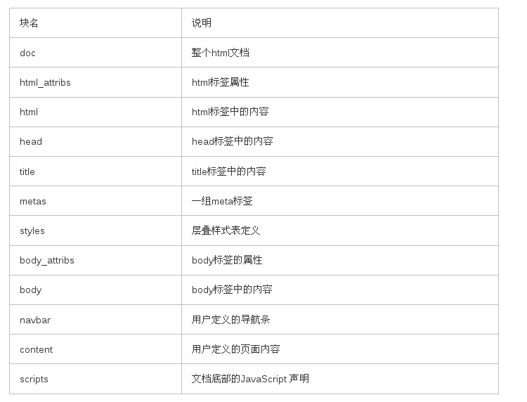

# Bootstrap简介
Bootstrap（http://getbootstrap.com/）是Twitter 开发的一个开源框架，
它提供的用户界面组件可用于创建整洁且具有吸引力的网页，而且这些网页还能兼容所有现代Web 浏览器。


# 为什么需要在Flask中集成Bootstrap?

Flask模板集成Bootstrap。一般情况下Flask都是搭配Jinja2模板引擎来实现视图展现，
不过现在Bootstrap比较流行，内置的样式也比较好看，有利于提高开发效率.


# Flask中如何使用集成的Bootstrap?

要想在程序中集成Bootstrap，显然要对模板做所有必要的改动。
不过，更简单的方法是使用一个名为Flask-Bootstrap 的Flask 扩展，简化集成的过程。
Flask-Bootstrap 使用pip安装：

```
pip install flask_bootstrap
```

　Flask 扩展一般都在创建程序实例时初始化，Flask_Bootstrap的初始化方法:

```

from flask_bootstrap import Bootstrap
bootstrap = Bootstrap(app)
```

初始化Flask-Bootstrap 之后，就可以在程序中使用一个包含所有Bootstrap 文件的基模板base.html。
这个模板利用Jinja2 的模板继承机制，让程序扩展一个具有基本页面结构的基模板，其中就有用来
引入Bootstrap 的元素。
- Jinja2 中的extends 指令从Flask-Bootstrap 中导入bootstrap/base.html， 从而实现模板继承。
- Flask-Bootstrap 中的基模板提供了一个网页框架，引入了Bootstrap 中的所有CSS 和JavaScript 文件。
- 基模板中定义了可在衍生模板中重定义的块。block 和endblock 指令定义的块中的内容可添加到基模板中。

- [导航条链接](https://v3.bootcss.com/components/#navbar)

```


Flask


<div class="navbar navbar-inverse" role="navigation">
    <div class="container">
        <div class="navbar-header">
            <button type="button" class="navbar-toggle"
            data-toggle="collapse" data-target=".navbar-collapse">
                <span class="sr-only">Toggle navigation</span>
                <span class="icon-bar"></span>
                <span class="icon-bar"></span>
                <span class="icon-bar"></span>
            </button>
            <a class="navbar-brand" href="/">Flasky</a>
        </div>
        <div class="navbar-collapse collapse">
            <ul class="nav navbar-nav">
                <li><a href="/">Home</a></li>
            </ul>
        </div>
    </div>
</div>



<div class="container">
    <div class="page-header">
        <h1>Hello, {{ name }}!</h1>
    </div>
</div>


```


# Bootstrap警告框组件

- [](https://v3.bootcss.com/components/#alerts)
```
<div class="alert alert-success" role="alert">...</div>
<div class="alert alert-info" role="alert">...</div>
<div class="alert alert-warning" role="alert">...</div>
<div class="alert alert-danger" role="alert">...</div>
```


```
<div class="alert alert-warning alert-dismissible" role="alert">
  <button type="button" class="close" data-dismiss="alert" aria-label="Close"><span aria-hidden="true">&times;</span></button>
  <strong>Warning!</strong> Better check yourself, you're not looking too good.
</div>
```


# Flask-Bootstrap自定义模板块

Flask-Bootstrap 的base.html 模板还定义了很多其他块，都可在衍生模板中使用，下表列出了所有可用的块：




# Flask-Bootstrap自定义模板块的继承实现
上表中的很多块都是Flask-Bootstrap 自用的，如果直接重定义可能会导致一些问题。例如，Bootstrap 所需的文件在styles 和scripts 块中声明。如果程序需要向已经有内容的块中添加新内容，必须使用Jinja2 提供的super() 函数。例如，如果要在衍生模板中添加新的JavaScript 文件，需要这么定义scripts 块：


{{ super() }}
<script type="text/javascript" src="my-script.js"></script>


